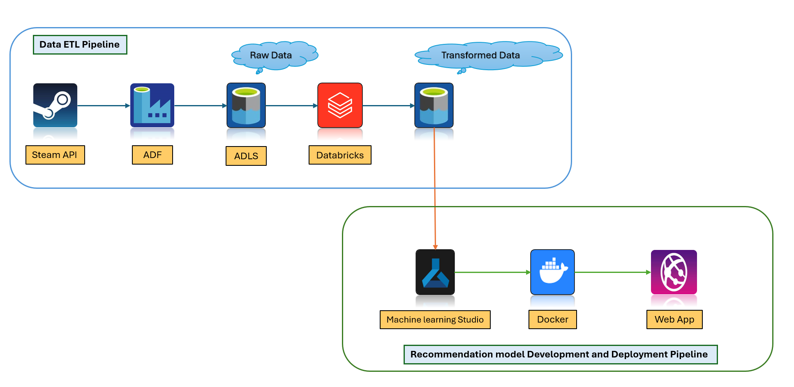

# 🎮 Game Recommendation Engine with Azure!  

As part of my journey to enhance my end-to-end skills in cloud technology, I built a practical and fun project: a **Game Recommendation Engine** powered by the Azure stack! 🌩️  

---

## 🖼️ Interface Overview  

Here's a sneak peek at the app interface:  
  

[**Try it live here!**](https://steamgamerecommend.azurewebsites.net/). 

---

## 🌐 What’s This About?  

This web app provides personalized game recommendations based on your input. While it doesn’t include every Steam game (due to API limitations), it still offers a fantastic experience!  

### How It Works:
1. **Enter a game name.**  
2. **Choose the number of recommendations** (5 or 10).  
3. The app displays hyperlinked images of similar games.  
   - **Click an image** to visit the game’s website directly. 🎯 

---

## 🔧 End-to-End Workflow  

Here’s the data flow powering the app:  
  

### **Data ETL Pipeline**  
1. **Extract**: Game data fetched via the Steam API.  
2. **Orchestrate**: Azure Data Factory (ADF) manages the pipeline.  
3. **Store**: Raw and transformed data stored in Azure Data Lake Storage (ADLS).  
4. **Transform**: Data cleaned and prepared in Databricks Spark.  

### **Model Development and Deployment Pipeline**  
1. **Model Training**: Built a recommendation model using Azure Machine Learning Studio.  
2. **Containerization**: Packaged the model with Docker for seamless deployment.  
3. **Deployment**: Deployed as a web app using Azure App Service.  

---

## 🎯 Key Features  

- **Interactive Web App**: Built with Streamlit for an intuitive experience.  
- **Recommendation Model**: Combines TF-IDF with Nearest Neighbors for accurate results.  
- **Azure Integration**: End-to-end cloud pipeline from data ingestion to deployment.  
- **Dynamic Visuals**: Hyperlinked game images with links to their websites.  
